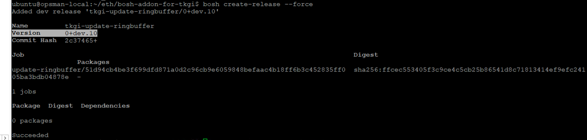
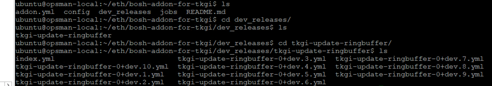

# Tanzu Kubernetes Grid Integrated (TKGI) / Run a shell script when creating a worker node

## What does this do? 

This sample goes thorugh a script that allows creating an add on to bosh that allows to run a script a script on the worker nodes when they are creates.
This specific example  installs the ethtool on the worker nodes and updates the ring buffer size for RX and TX. 

## Install the addon ?

1. SSH into opsman
2. Export the BOSH credentials, this can be found in the Metadata section within EPMC or in Opsmanager UI (these are well documented)

e.g.
```
BOSH_CLIENT=ops_manager BOSH_CLIENT_SECRET=ougHtXSkv_3Vi1tOKuA2G-bvSqdq2dP8 BOSH_ENVIRONMENT=172.31.0.3 BOSH_CA_CERT=/var/tempest/workspaces/default/root_ca_certificate bosh 
```

3. Copy or clone this repository onto this BOSH CLI workstation and create+upload the BOSH release to the director

```
git clone https://github.com/riazvm/bosh-addon-for-tkgi && cd bosh-addon-for-tkgi
bosh create-release --force
bosh upload-release ./dev_releases/tkgi-update-ringbuffer/tkgi-update-ringbuffer-0+dev.1.yml

```
4. Configure the addon from this repo
```
bosh -n update-config --name=tkgi-update-ringbuffer --type=runtime ./addon.yml
```
5. Update your TKGI clusters via the TKGI CLI and/or Ops Manager "Apply Pending Changes" button with the TKGI upgrade errand enabled. This addon will be automatically be deployed to the worker nodes

## Delete the addon?

6. To delete an add on do the following

Take a back up of addon.yml . Copy update-addon.yml to addon.yml
```
cp update-addon.yml addon.yaml
bosh -n update-config --name=tkgi-update-ringbuffer --type=runtime ./addon.yml
```
Follow step 5

## Update or new release of the addon?

7. To edit script and release a new version , update the script as per use case

8. Create a new version 


```
bosh create-release --force

```


Note the Release Version


9. Check release  under dev_releases folder



10. Update boosh release , note the release version in this case version 10, tkgi-update-ringbuffer-0+dev.10.yml

```
bosh upload-release ./dev_releases/tkgi-update-ringbuffer/tkgi-update-ringbuffer-0+dev.10.yml
```

11. Edit addon.yml to update the addon.yml to release version to the version that was created 0+dev.10

```
bosh -n update-config --name=tkgi-update-ringbuffer --type=runtime ./addon.yml
```

12. Update your TKGI clusters via the TKGI CLI and/or Ops Manager "Apply Pending Changes" button with the TKGI upgrade errand enabled. This addon will be automatically be deployed to the worker nodes

13. To verify ssh into the worker nodes and see if the script has been done.


